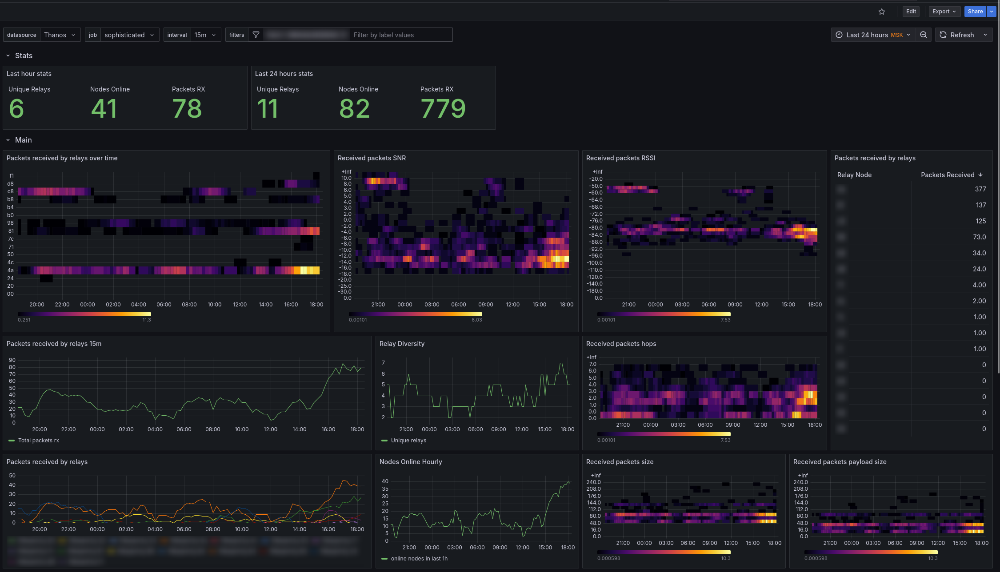
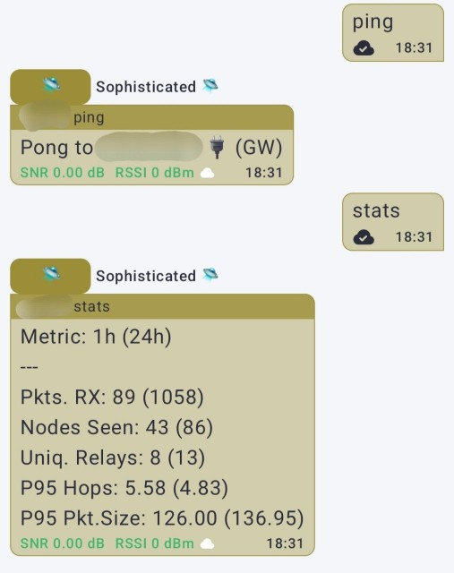
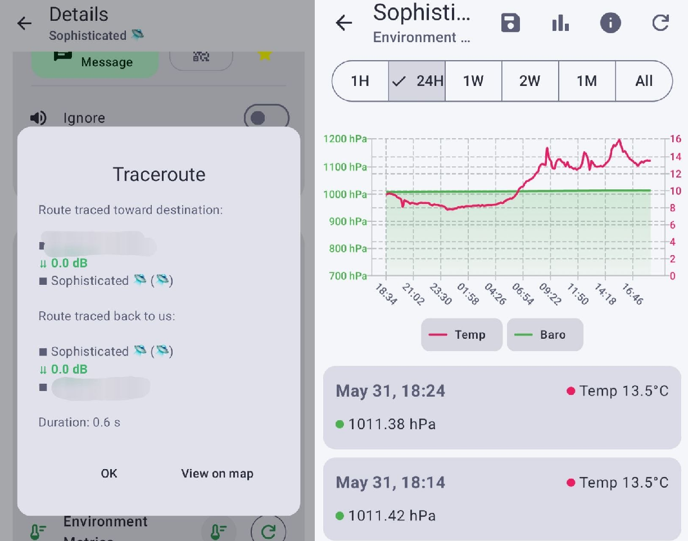

# Sophisticated
## Meshtastic node implementation in TypeScript
---
**Sophisticated** is my attempt to make fully standalone meshtastic node* in TypeScript.

In the current state this project is more of a proof of concept and testing/learning grounds.

**by meshtastic node i mean piece of software that implements protocols of meshtastic and can talk to other nodes*

For now, **Sophisticated** communicates with other nodes via MQTT and can seamlesly talk to other nodes in MQTT network. It implements simple chat bot and **Prometheus** metrics exporter.

In [example](example/readme.md) you can check out full deployment example with **Grafana**, **Prometheus** and **Mosquitto** via **Docker Compose**.

Dashboard for **Grafana** can be found in [dashboards](dashboards) folder.

### Showcase

#### Grafana Dashboard

#### Text Message Commands

#### Traceroutes and Environment Metrics

